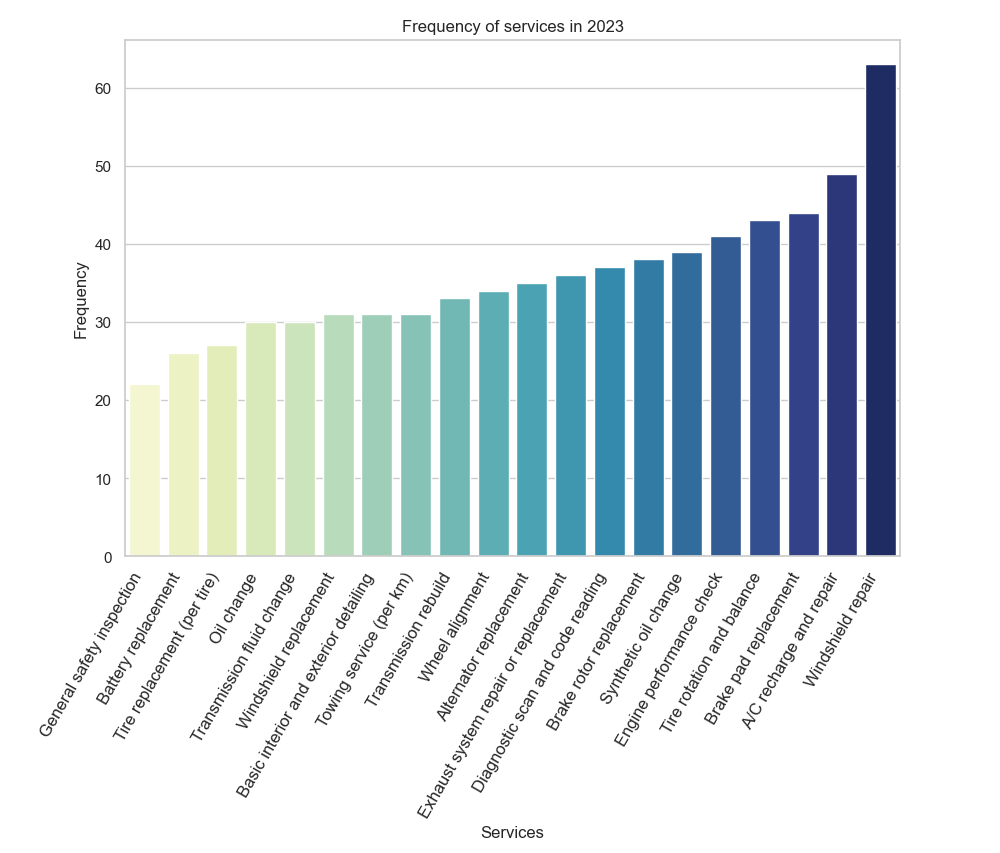
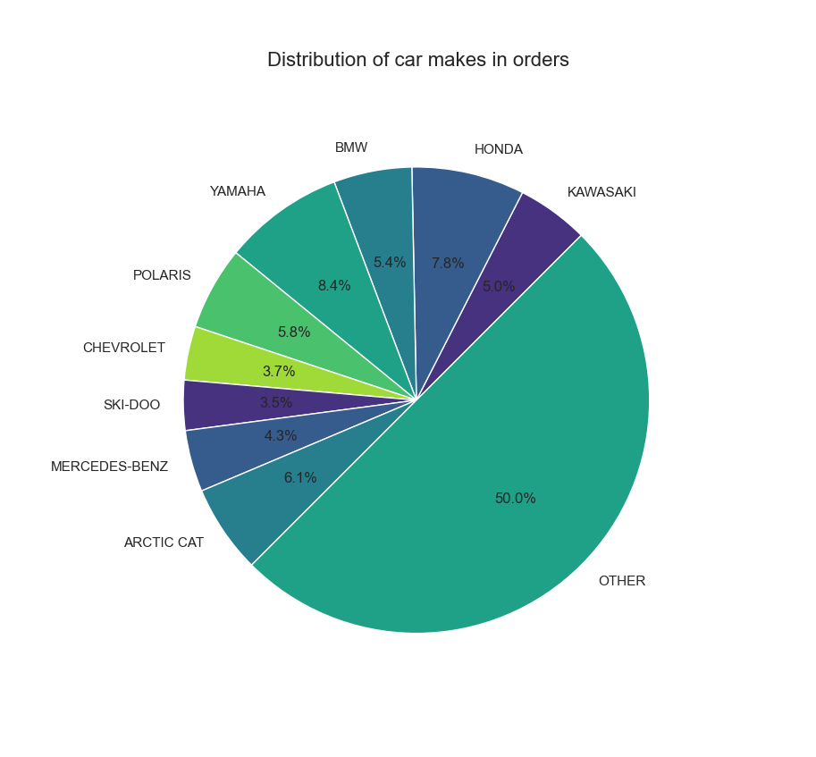
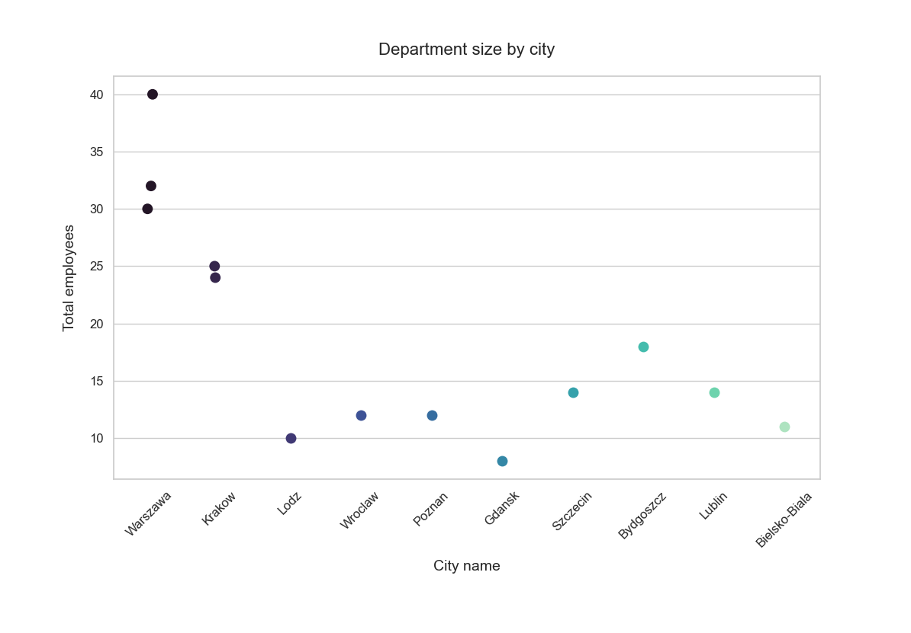
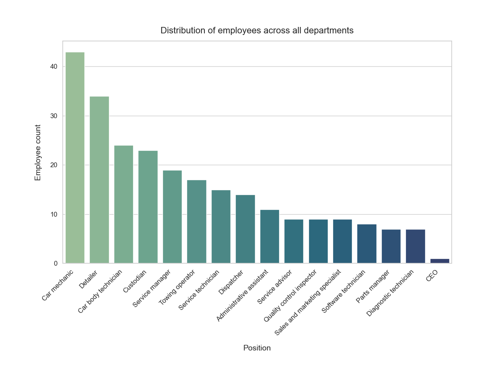
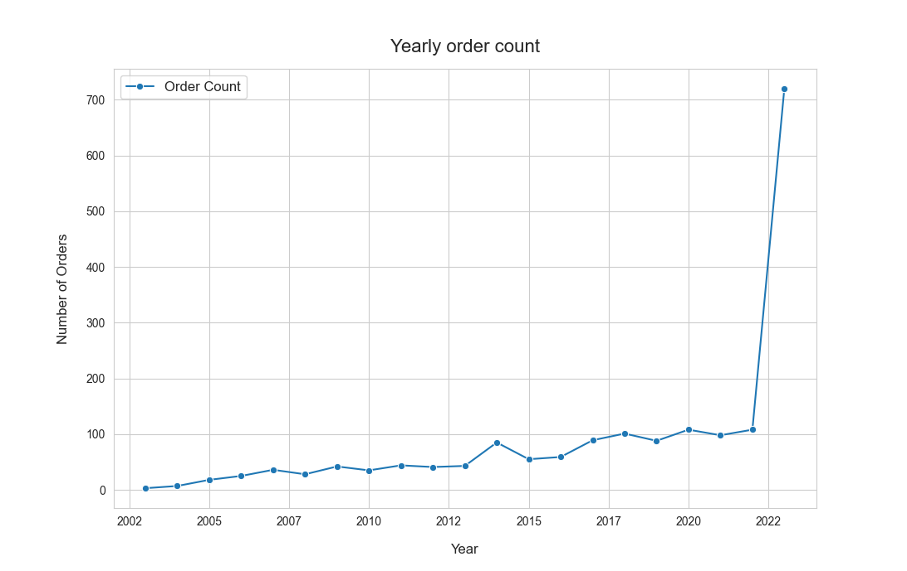

# Car service database

> Python package that generates a sample database for various database engines.

## About
This repo showcases my end-of-semester RBD (Relational databases) class project.
If you wish to use the database yourself, checkout the files with `.sql` extension.

## Purpose
The main goal of this project was to make use of all the knowledge gained during the semester, covering topics like:

- database modelling
- using various DBMS and SQL dialects
- elements of T-SQL & PL/SQL
- plain SQL

I expanded on it, integrating it with Python for data generation and plotting ([Seaborn](https://seaborn.pydata.org/), [Matplotlib](https://matplotlib.org/) modules).

## Tech used

    &nbsp;&nbsp;&nbsp;&nbsp;&nbsp;
    &nbsp;&nbsp;&nbsp;&nbsp;
    &nbsp;&nbsp;&nbsp;&nbsp;
    &nbsp;&nbsp;&nbsp;&nbsp;
    &nbsp;&nbsp;&nbsp;&nbsp;
     
    &nbsp;&nbsp;&nbsp;&nbsp;
    

## Entity-relationship diagram

## Plots

