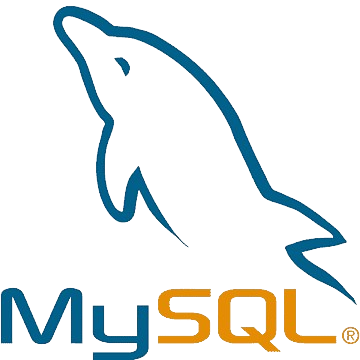

# Car service database

## About
This repo showcases an extension to my end-of-semester RBD (Relational databases) class project. It's a database model for a sample car service company, and to make it more interesting, I generated some exemplary data, ported it to MySQL and analyzed it with queries and Seaborn/Matplotlib. If you wish to use the database yourself, checkout the files with `.sql` extension.

## Tech used

    
    
    
    
    
    

## Entity-relationship diagram

## Plots

