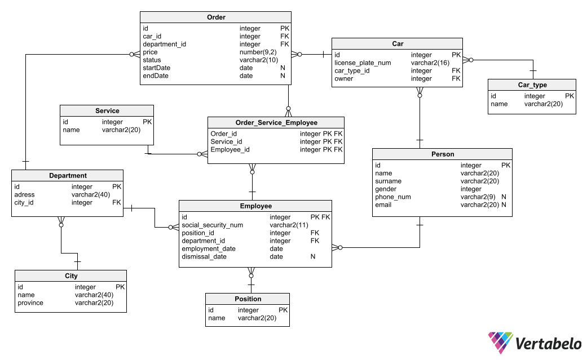

# Car company database

## About
WORK IN PROGRESS

## File description

- `ddl-create.sql` - uses DDL to create tables and add constraints
- `ddl-drop.sql`- uses DDL to drop tables and constraints
- `dml-sample-data.sql`- uses DML to fill tables with sample data
- `queries.sql` - contains ~25 queries of various complexity

## Entity-relationship diagram

